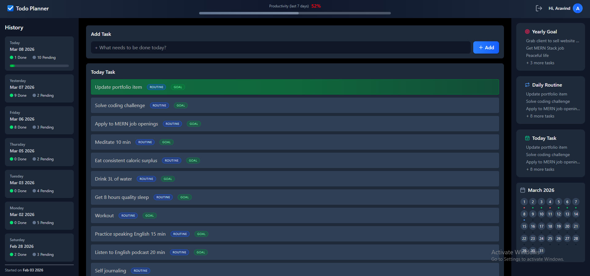
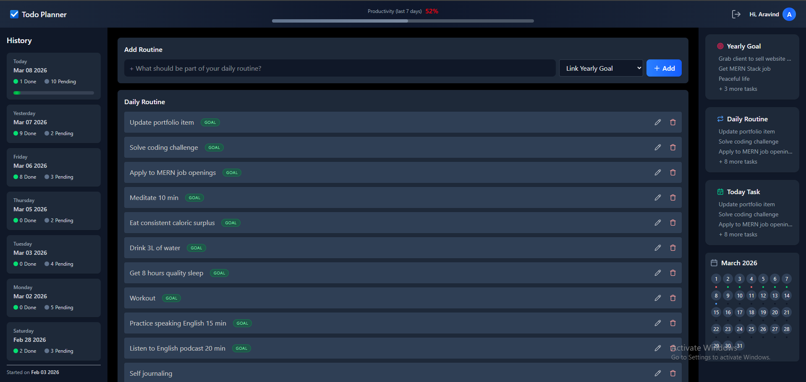
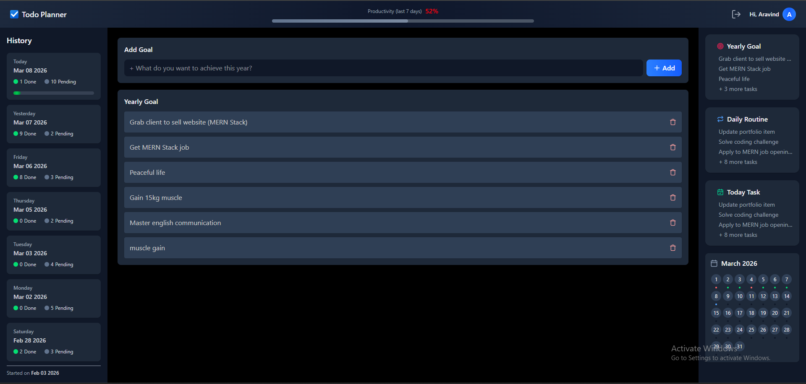
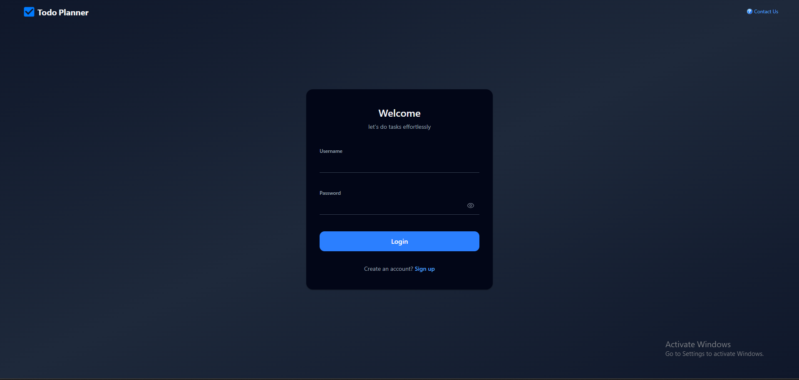

# # WorkZone – AI-Powered Goal-to-Routine SaaS

> A full-stack productivity SaaS that turns yearly goals into structured daily routines — with AI-powered generation, secure authentication, and 7-day productivity tracking.

🚀 **Live Demo:** [https://workzone-todo.vercel.app/](https://workzone-todo.vercel.app/)

---

## Why I Built This

Most todo apps are just lists. I wanted to build something that actually connects daily actions to long-term goals — and understand how real SaaS applications handle auth, session security, and scalable backend architecture while doing it.

---

## Screenshots

> Dashboard  

> Daily Routine  

> Yearly Goals  

> Login  

---

## Features

### Authentication & Security
- JWT-based authentication using HTTP-only cookies
- Short-lived access tokens with refresh token rotation on every use
- Refresh token reuse detection — prevents replay attacks
- Session invalidation on token mismatch
- Middleware-protected routes with proper 401 / 403 handling

### Task System
- Three task types: **Today Tasks**, **Daily Routines**, **Yearly Goals**
- Routine → Today automatic daily sync
- Goal-linked task relationships
- Soft delete support
- 7-day productivity tracking with progress bar
- 30-day history aggregation

### AI-Powered Routine Generation
- Converts yearly goals into structured daily routines using AI
- Controlled prompt engineering with structured JSON parsing
- Auto-links generated routines back to their parent goals

### Email Verification *(dev-ready)*
- Secure random token generation with SHA256 hashed storage
- Expiry validation and dedicated verification endpoint
- Disabled in production pending email provider setup — fully functional in development

---

## Tech Stack

| Layer | Tech |
|---|---|
| Frontend | React (Vite), Tailwind CSS, Redux Toolkit + RTK Query |
| Backend | Node.js, Express |
| Database | MongoDB (Mongoose) |
| Auth | JWT, HTTP-only cookies, Refresh token rotation |
| AI | Gemini Integrated (Suggestion, error handling) |

---

## Architecture Highlights

- **Refresh token rotation** — every token use issues a new token and invalidates the old one
- **Reuse detection** — if a used token is replayed, the entire session is invalidated
- **Goal → Routine → Today pipeline** — tasks flow down from yearly goals to daily actions automatically
- **RTK Query** — all API state managed with caching, invalidation, and optimistic updates

---

## Roadmap

- [ ] Forgot password flow
- [ ] Role-based access control
- [ ] Analytics dashboard

---

## Author

**Aravind A** — MERN Stack Developer

📧 [aravind.workzone@email.com](mailto:aravind.workzone@email.com).
